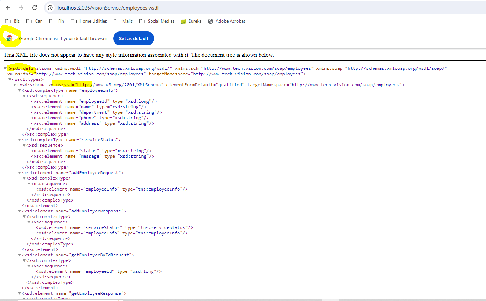
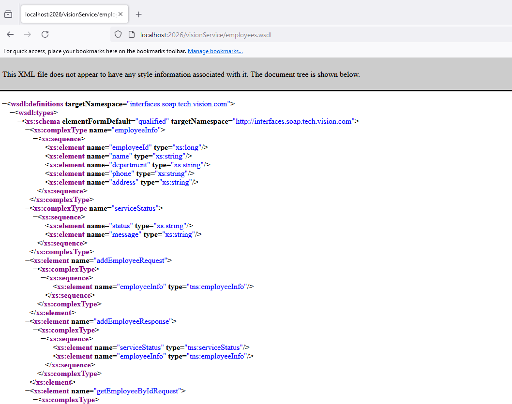
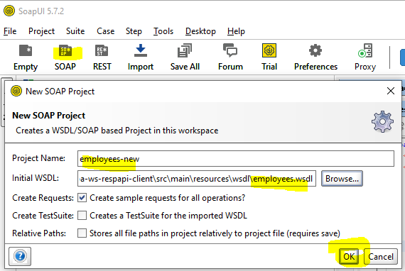

# Spring Boot SOAP web service
- Two Spring Boot services (1) SOAP api with JPA demo.
- Project: Maven
- Application Framework: Spring Boot (2.7.1)
- Language: Java (8)
- Packaging: Jar
- Dependencies (Spring Web, Lombok, Spring Data JPA, Spring Devtools, jaxb2, MySQL db.
- NOTE: Recommand to use mvn command (mvn clean compile package) instead of IDE as Jaxb2 creates issue for loading.

## (1) Spring Boot SOAP API (soap-ws-jpa-crud)
- Note: 
- (1). Configure application.properties with db authentication.
- (2). Run the application (it is assign to port 2026)

## Load the WSDL
- (1). Go to Chrome browser: http://localhost:2026/visionService/employees.wsdl
- (2). Open your SOAPUI tool (or download https://www.soapui.org/downloads/thank-you-for-downloading-soapui/)
- (3). Add the WSDL to the SOAPUI and test 

## WSDL in Chrome Browser (Use Chrome Browser to use WSDL).
-
## WSDL in Firefox Browser
-

## SPAP UI WSDL setup
-

